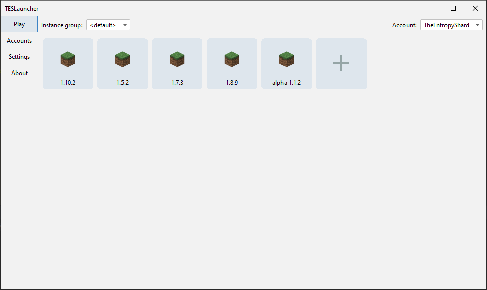

# TESLauncher

> [!WARNING]  
> This project is unfinished. Do not have any expectations.

Yet another launcher for Minecraft 


### Quick start:
You will need at least <strong>JDK 8</strong> to build and run this project.
```shell
git clone https://github.com/TESLauncher/TESLauncher
cd TESLauncher
gradlew shadowJar
```
If "BUILD SUCCESS" is displayed, use the following command to run the launcher:
```shell
java -jar build/libs/TESLauncher-0.12.1.jar
```

### Warning
Launcher will create its folders in the directory where `java` command was executed. That means that if you run <br>
```shell
java -jar build/libs/TESLauncher-0.12.1.jar
```
launcher will run in project's root directory. If you want to run the launcher in any other place, specify a path to the working directory using `--workDir` parameter. <br>
Example:
```shell
java -jar build/libs/TESLauncher-0.12.1.jar --workDir C:\Users\User\Documents\TESLauncher
```
Alternatively, you can use `--useJarLocation` argument, which will make the launcher use the folder for its files where the jar file is located. <br>
In that case the `--workDir` argument is ignored. Example:
```shell
java -jar build/libs/TESLauncher-0.12.1.jar --useJarLocation
```
This way the launcher files will be created in build/libs.